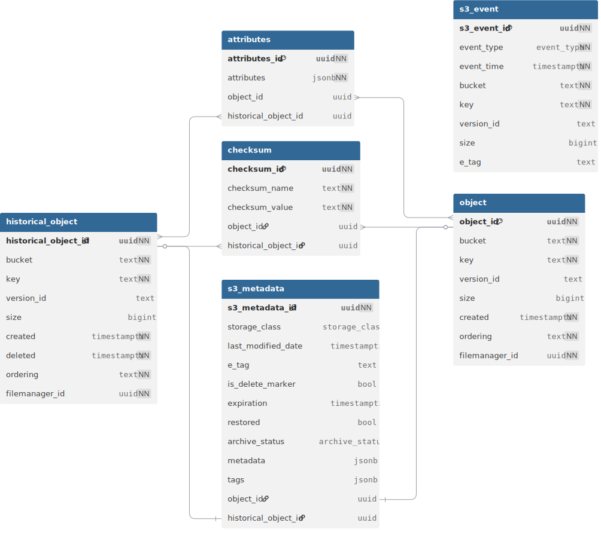

## Filemanager V2 database modelling

The filemanager database model and API will be updated to expand support for new features and fix performance issues.

### Motivation

The filemanager database design results in slow queries for certain operations such as queries on key substrings. This
is because the model contains all data in a single flat table. This table has new data entries appended to it every time
there is an event in S3. These entries, even though they represent historical data, are never deleted, which results in
a table that accumulates many entries quickly. This issue is partially mitigated by indexing the table on the `current_state`
of data, which does improve speed for some queries. However, the proper solution involves separating out the table into
a more normalized database design (see https://github.com/OrcaBus/service-filemanager/issues/23).

A further motivation behind the change is to add new features which are current not possible, such as grouping objects
and attributes, or checksums. For example, the `portal_run_id` is stored inside the filemanager `attributes` column which
is `jsonb` data. While this works well, a more efficient design would involve a separate table that can add attributes
to multiple objects in a group. With regard to checksums, this would also require an additional table to support multiple
kinds of checksums (see https://github.com/OrcaBus/service-filemanager/issues/30). Further features could involve supporting
multiple kinds of cloud storage, i.e. not just S3.

### Requirements

1. Inserting and selecting entries from the table should be fast and efficient, without the database having to look through millions of records.
2. History should still be maintained in some way, so that deleted objects are tracked in the database.
3. Objects must be tracked as they move from one location to another, and it should be straight-forward to determine how an object has moved when querying it.
4. It should be possible to group objects and add information to those groups to support things like the `portal_run_id` - querying on groups should be fast.
5. It should be possible to determine which objects are identical based on any available checksums.
6. Multiple cloud storage providers should be supported in a generalized way.

### Proposed design

The design splits the existing `s3_object` table into two primary tables, `object` and `historical_object`. The `object`
table represents the `current_state` of data, and `historical_object` contains all previous records for the `bucket`, `key`
and `version_id`. There is a concurrently running `s3_event` table which determines records for `object` and `historical_object`
by handling S3 event specific data like ordering and deduplication. This table can be more aggressively pruned for out of date
records as the history will be tracked in `historical_object`. This addresses requirements 1-2. Querying will be fast
because the `object` table will only contain current records, which will be a smaller subset of total historical records.

The above 3 tables are all linked together with a `filemanager_id` which addresses requirement 3, along-side object tagging.
This will be similar in functionality to the existing `ingest_id`, and allows move tracking.

There is a further `attributes` table, which allows arbitrary `attributes` to tag specific groups of objects, and a `checksum`
table which tracks any checksum. This addresses requirements 4-5. The `attributes` table functions similarly to the `attributes`
column in the current design. E.g. for `portal_run_id`, the JSON key would represent the existing `portalRunId`.
The `checksum` table can be considered a specialization of the `attributes` table for checksum specific logic as it stores
a single key and value.

Each object is also attached to an `s3_metadata` table which contains S3-specific fields, and has the possibility to be
extended to support other cloud storage providers. This, alongside the separate `s3_event` table, addresses requirement 6.
It also has the advantage of allowing the main filemanager ingestion loop to occur separately to determining object metadata,
which allows using separate Lambda functions or different permission sets for ingestion and metadata.

### Files

The above database model is available in the `*.sql` file in this directory.
