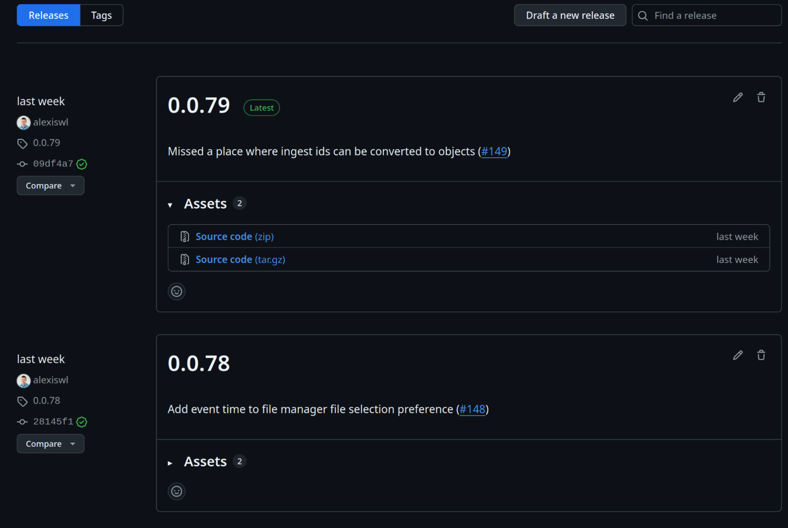
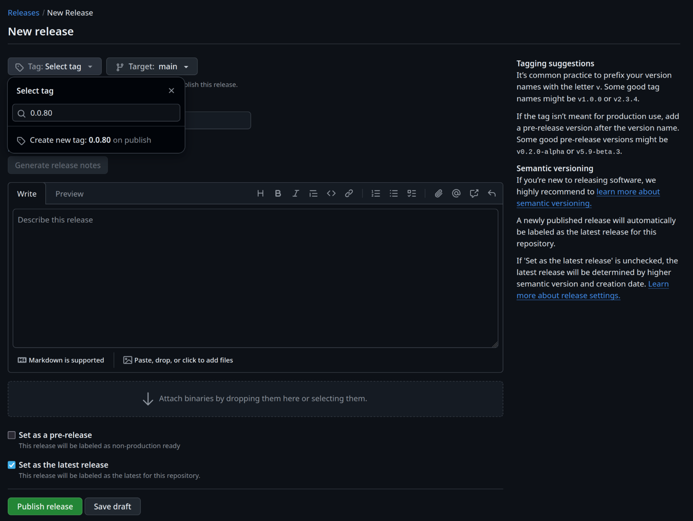
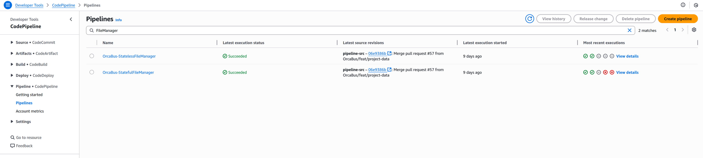
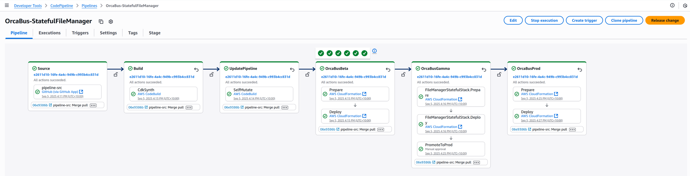
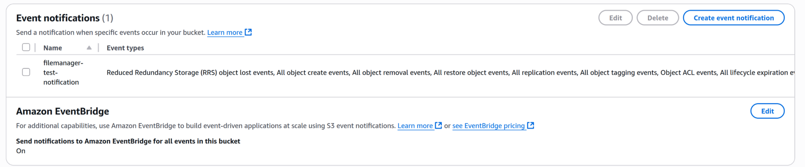
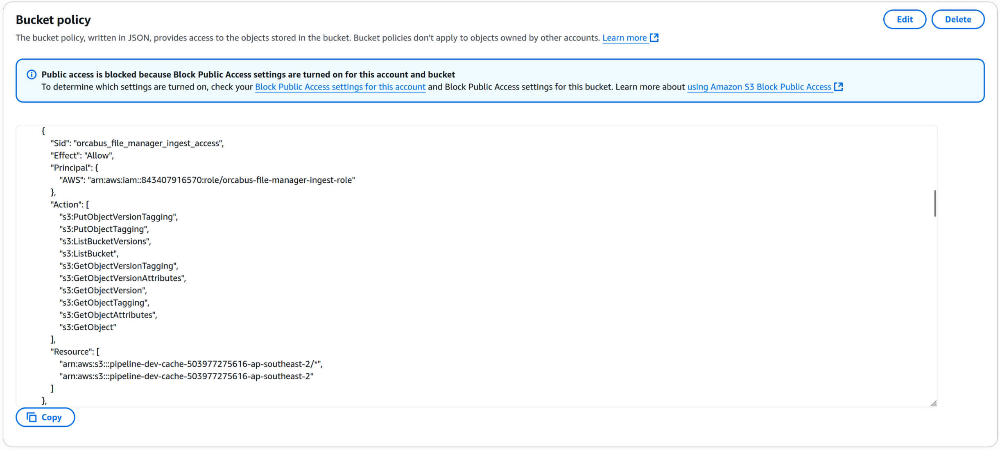
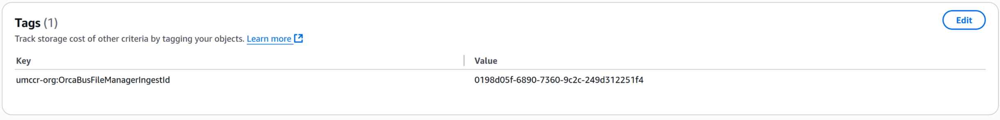

# FM.1 - Add Ingest Bucket to the FileManager

The following SOP describes how to add a bucket to the filemanager to ingest S3 events from it.

## Introduction

The filemanager keeps track of objects using [S3 events][s3-events] which are forwarded to the filemanager using
EventBridge. This happens on a per-bucket level, which means that for the filemanager to track objects in a new
bucket, it needs to be registered as an event rule that forwards S3 events to the filemanager's queue.

## Procedure

There are two parts to the procedure:

1. Registering the bucket with the filemanager infrastructure in this codebase.
2. Setting up the bucket.

Both steps 1. and 2. can be performed independently.

### FileManager Infrastructure Update

The first step updates the filemanager infrastructure with the changes.

#### Updating platform-cdk-constructs

To register the bucket with the filemanager, an update needs to be made to the
[platform-cdk-constructs library][platform]. This library contains the buckets that filemanager uses as shared config
values, and is reflected in this codebase as a dependency.

First, the bucket name should be added to the filemanager [constants file][constants] in the shared-config. Add the
bucket name to the `FILE_MANAGER_BUCKETS` constant, under the desired environment - `BETA`, `GAMMA` or `PROD`. This
controls the buckets that are ingested by the filemanager in the environment. Each bucket added here will ingest all
objects, excluding directories.

There is an alternative `FILE_MANAGER_CACHE_BUCKETS` constant which ingests all objects except for those under a
`byob-icav2/*/cache/*` pattern. This is currently only used for the pipeline cache buckets.

After adding the bucket, ensure that documentation is generated and any styling is applied by following the development
instructions in the platform-cdk-constructs [README][readme]. Then, create a pull request with the changes.

> [!TIP]
> An example of a pull request for this step can be viewed [here][pr-example-1].

After merging the pull request, the changes need to be published to npm by creating a new release. To do so, press
"Draft a new release" under the releases page:



Then, create a new tag - incrementing the semantic version, press "Generate release notes" and then "Publish release":



#### Updating the filemanager infrastructure

The shraed constant in the platform-cdk-constructs library is reflected into the filemanager infrastructure as a
dependency. `FILE_MANAGER_BUCKETS` is used inside this repo in [config.ts][config]. All that needs to be updated is
the version of `platform-cdk-constructs` in [package.json][package] for changes to take effect.

After updating the package.json, run `make install && make check` to also update the lock file and ensure that styling
is applied. Also, to ensure that tests pass, update [stage.test.ts][test-stage] to suppress warnings about IAM5 wildcard
permissions for the bucket. This warning can be suppressed as the filemanager requires access to all objects in the
bucket. Then, create a pull request with the changes.

> [!TIP]
> An example of a pull request for this step can be viewed [here][pr-example-2].

After merging the pull request, ensure that the changes run through completely in CodePipeline in the bastion
account (383856791668). Manual approval is required to propagate changes to the production account (472057503814).
This should occur independently for both the `OrcaBus-StatelessFileManager` and `OrcaBus-StatefulFileManager` pipelines:



For both of these pipelines, approve the "PromoteToProd" step once that stage is reached:



### Updating bucket settings

The bucket is not created or controlled by the filemanager, which means that bucket settings need to be configured
correctly to make sure that objects are ingested.

#### Ensure that events are forwarded to EventBridge

The filemanager relies on EventBridge to process S3 events. This can be checked under the bucket properties in the
"Event notifications" tab:



The "Send notifications to Amazon EventBridge for all events in this bucket" option should be ticked.

#### Cross account bucket permissions

The filemanager accesses buckets using a role called `orcabus-file-manager-ingest-role`. It needs to be able to look up
metadata from objects and tag objects for all functionality to be enabled.

If the bucket and the filemanager deployment are both in the same account, then this step can be skipped.

For cross-account buckets, the bucket policy should allow the filemanager role access to the bucket with the following
permissions:

- For ingesting objects and calling `HeadObject`.
  - `s3:GetObject`
  - `s3:GetObjectVersion`
- For crawling objects and listing buckets.
  - `s3:ListBucket`
  - `s3:ListBucketVersions`
- For tagging objects to track moves.
  - `s3:GetObjectTagging`
  - `s3:GetObjectVersionTagging`
  - `s3:PutObjectTagging`
  - `s3:PutObjectVersionTagging`

This can be achieved by allowing the cross-account principal access using the filemanager role. As an example,
the pipeline cache buckets have the following policy statements:



This allows the filemanager in the development account (843407916570) access to the bucket in the data account
(503977275616).

> [!TIP]
> An example of a pull request allowing the filemanager role access can be viewed [here][pr-example-3].

The exact steps required will be dependent on how the bucket is created and maintained.

> [!NOTE]
> It's very important to ensure that the filemanager has permission to access the bucket because features like move
> tracking won't work otherwise. Core functionality like object ingestion will work as long as events are received even
> if there are no permissions to access the bucket.

## Checking it works

To check that tracking works, upload a test file, and then call the filemanager API with the bucket and key.

First, obtain the access token:

```sh
export TOKEN=$(aws secretsmanager get-secret-value --secret-id orcabus/token-service-jwt --output json --query SecretString | jq -r 'fromjson | .id_token')
```

Then, query the API, replacing `<key>` with the test file key and `<bucket>` with the new bucket:

```sh
export key="<key>" && bucket="<bucket>"
curl -H "Authorization: Bearer $TOKEN" "https://file.prod.umccr.org/api/v1/s3?key=$key&bucket=$bucket" | jq
```

The output should contain the `storageClass` and `ingestId` if permissions are correctly set:

```json
{
  "links": {
    "previous": null,
    "next": null
  },
  "pagination": {
    "count": 1,
    "page": 1,
    "rowsPerPage": 1000
  },
  "results": [
    {
      "s3ObjectId": "0198d05f-6848-73c1-afa5-2c5536ebaad6",
      "eventType": "Created",
      "bucket": "<bucket>",
      "key": "<key>",
      "versionId": ".31IS49UMDPyZsX.J84CCJUFCYmHV5oE",
      "eventTime": "2025-08-22T06:02:48Z",
      "size": 2596799,
      "sha256": null,
      "lastModifiedDate": "2025-08-22T06:02:49Z",
      "eTag": "\"6dc47e886b9f2ecef870af88da3ebdd6\"",
      "storageClass": "Standard",
      "sequencer": "0068A808082736DEA4", // pragma: allowlist secret
      "isDeleteMarker": false,
      "numberDuplicateEvents": 0,
      "attributes": null,
      "deletedDate": null,
      "deletedSequencer": null,
      "numberReordered": 0,
      "ingestId": "0198d05f-6890-7360-9c2c-249d312251f4",
      "isCurrentState": true,
      "reason": "CreatedCopy",
      "archiveStatus": null,
      "isAccessible": true
    }
  ]
}
```

The S3 tags on the object should also have `umccr-org:OrcaBusFileManagerIngestId` matching the value of the `ingestId`
in the output:



[s3-events]: https://docs.aws.amazon.com/AmazonS3/latest/userguide/EventNotifications.html
[platform]: https://github.com/OrcaBus/platform-cdk-constructs/
[constants]: https://github.com/OrcaBus/platform-cdk-constructs/blob/main/packages/shared-config/file-manager.ts
[readme]: https://github.com/OrcaBus/platform-cdk-constructs/blob/main/README.md
[pr-example-1]: https://github.com/OrcaBus/platform-cdk-constructs/pull/142
[pr-example-2]: https://github.com/OrcaBus/service-filemanager/pull/57
[pr-example-3]: https://github.com/umccr/infrastructure/pull/559
[config]: ../../infrastructure/stage/config.ts
[package]: ../../package.json
[test-stage]: ../../test/stage.test.ts
